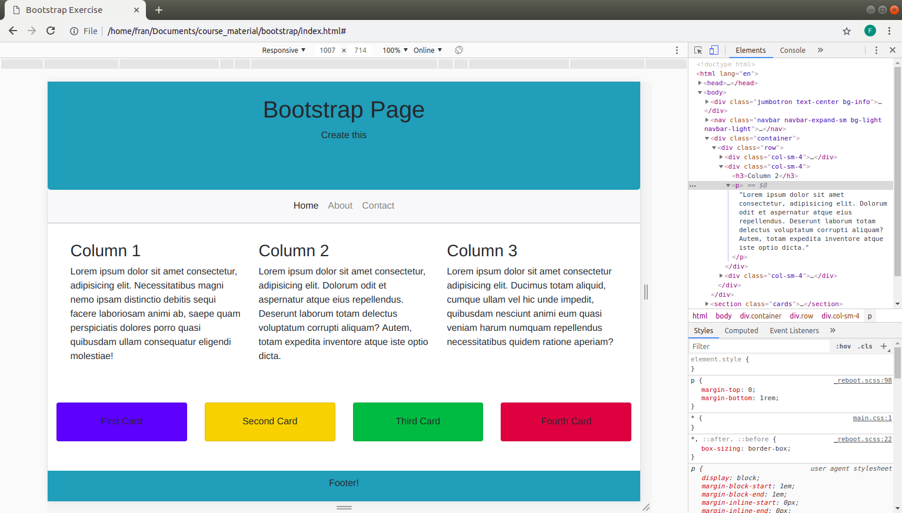

# Bootstrap - Page Building - Exercise #1

Create a simple page using bootstrap.

See the mockup reference image below as a guide.

Your page must include:

- a banner
- a navigation bar
- a simple grid system and cards

Mockup:

Refer to the bootstrap documentation for more info.

Good luck!
